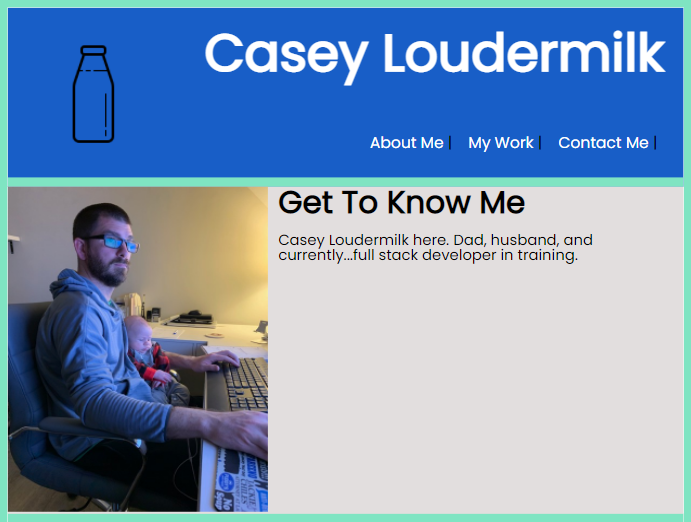

# 02 Advanced CSS: Portfolio

## What It Is

 This was my first website from start to finish.  This website is my virtual portfolio that I will continually add my projects to throughout my coding development journy.  Although it is rudimentary, I am very proud of it. 


## What I did

I created both an html and css file from scratch for the 1st time.  I was able to link the style sheet to the html page and build out both per the requirements below.  I added styling of my choice and attempted to use semantic html elements to create clean code for others to follow.

I was able to to create a few effects and learn a lot along the way, such as css grid layout.  I was able to effectively embed images and make usable links to other sites.


## Acceptance Criteria I followed

Here are the critical requirements necessary to develop a portfolio that satisfies a typical hiring manager’s needs:

```
GIVEN I need to sample a potential employee's previous work
WHEN I load their portfolio
THEN I am presented with the developer's name, a recent photo, and links to sections about them, their work, and how to contact them
WHEN I click one of the links in the navigation
THEN the UI scrolls to the corresponding section
WHEN I click on the link to the section about their work
THEN the UI scrolls to a section with titled images of the developer's applications
WHEN I am presented with the developer's first application
THEN that application's image should be larger in size than the others
WHEN I click on the images of the applications
THEN I am taken to that deployed application
WHEN I resize the page or view the site on various screens and devices
THEN I am presented with a responsive layout that adapts to my viewport
```


## Website Link/Screenshot



[portfolio website](https://cloud3118.github.io/homework2-advcss/)


## Kudos

I want to thank Awesomefonts.com for the social media pictures.

My tutor Juan Delegado was instrumental in helping me figure out some of my folies

The entire GT Bootcamp Teaching team for their continued patience as I work through issues with my code.


